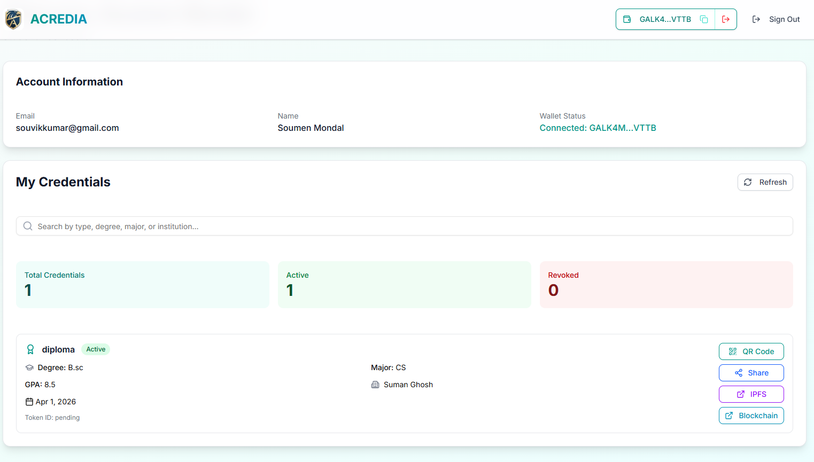
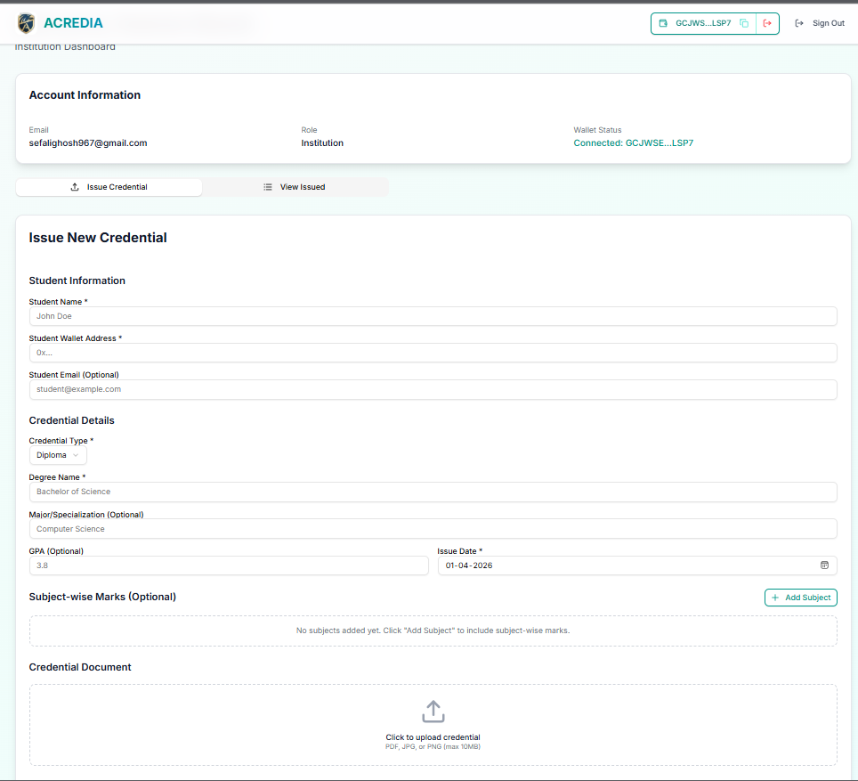
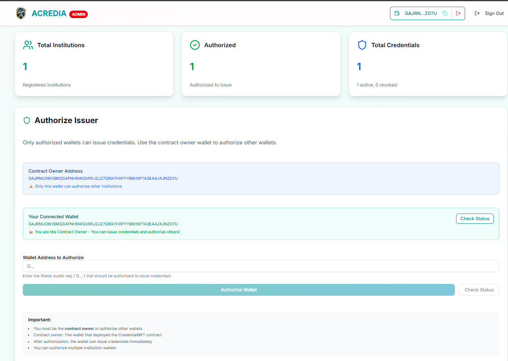
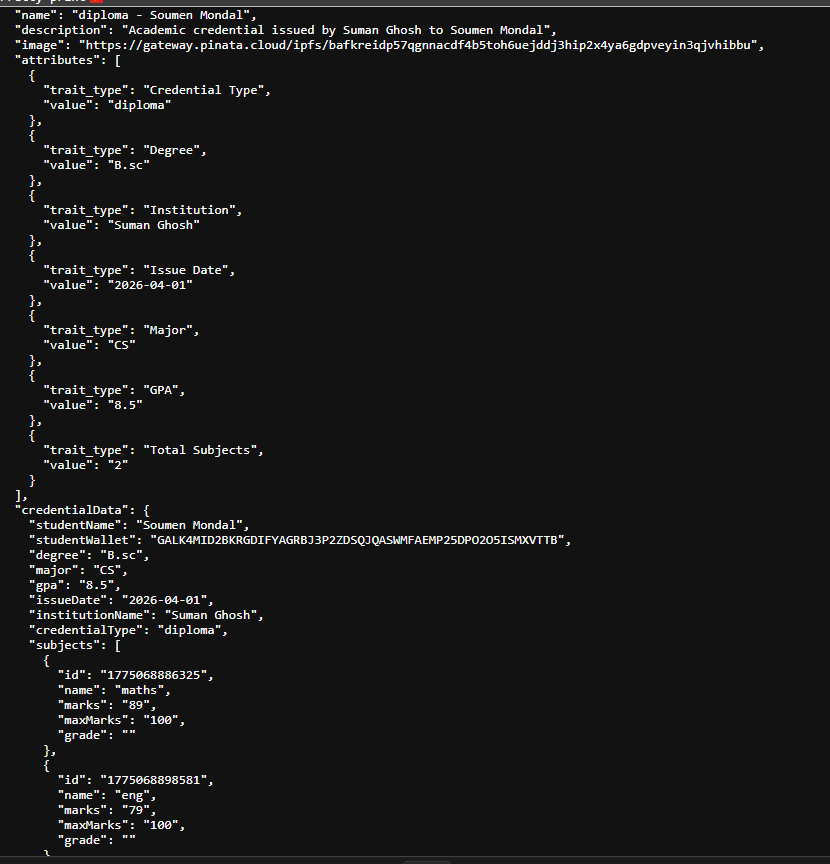
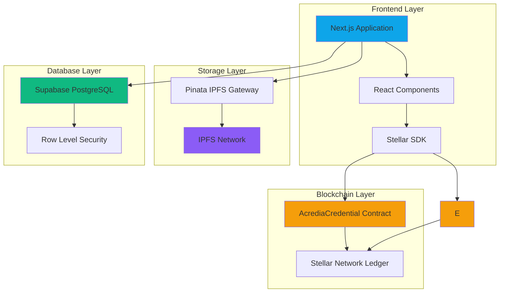
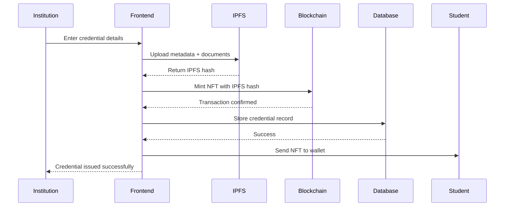
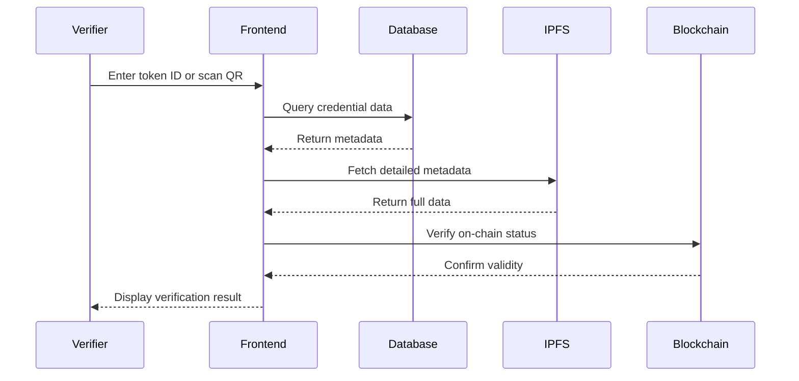

<div align="center">
  
  
  # ACREDIA
  ### Blockchain-Based Academic Credential Verification System
  
  *Secure, Transparent, and Tamper-Proof Educational Credentials on Stellar Network*


---

### 🎯 Built on Stellar Network

**Cost-effective transactions** • **Fast settlement** • **Decentralized infrastructure** • **Native Soroban contracts**

[🌐 Stellar Network](https://stellar.org) | [📊 Stellar Expert Explorer](https://stellar.expert) | [💧 Get Test XLM](https://laboratory.stellar.org/)

<h3><a href="https://acredia-stellar-tau.vercel.app/"> 🌐 VIEW LIVE DEMO </a></h3>
<h3><a href="https://youtu.be/CG7UF-_Du2Y"> 📽️ VIEW LIVE DEMO </a></h3>

</div>

---

## 📑 Table of Contents

- [Overview](#-overview)
- [Why Stellar Network](#-why-stellar-network)
- [The Problem](#-the-problem)
- [Our Solution](#-our-solution)
- [Screenshots](#-screenshots)
- [Key Features](#-key-features)
- [Smart Contracts](#-smart-contracts)
- [Technology Stack](#-technology-stack)
- [Testing Strategy](#-testing-strategy)
- [System Architecture](#-system-architecture)
- [How It Works](#-how-it-works)
- [Getting Started](#-getting-started)
- [Environment Setup](#-environment-setup)
- [Usage Guide](#-usage-guide)
- [Project Structure](#-project-structure)

---

## 🌟 Overview

**Acredia** is a revolutionary decentralized platform that transforms how academic credentials are issued, stored, and verified. Built on **Stellar Network**, a decentralized network focused on financial inclusivity and fast, low-cost transfers, Acredia leverages blockchain technology, IPFS, and modern web technologies to eliminate credential fraud, reduce verification time, and provide lifetime access to verified academic records.

### Why Acredia?

Traditional paper-based or centralized digital credentials suffer from:

- Easy forgery and tampering
- Time-consuming verification processes
- Risk of loss or damage
- Limited accessibility
- Centralized control and single points of failure

Acredia solves these problems by creating **immutable, blockchain-verified credentials** that are:

- ✅ Permanent and tamper-proof
- ✅ lntly verifiable
- ✅ Decentralized and censorship-resistant
- ✅ Accessible anywhere, anytime
- ✅ Privacy-preserving with student control

---

## 🚀 Why Stellar Network?

Acredia is built on **Stellar Network**, a decentralized network focused on providing financial inclusion and fast, low-cost transfers of assets globally:

### Key Benefits

**💰 Cost-Effective Transactions**

- Minimal transaction fees (less than a cent)
- Makes credential issuance affordable for educational institutions worldwide
- Students can claim credentials without significant costs

**⚡ Fast Settlement**

- Transaction finality in 3-5 seconds
- Instant credential verification
- Improved user experience with near-instant confirmations

**🌍 Global Reach & Accessibility**

- Designed for global financial inclusion
- Works on low-bandwidth connections
- Accessible from anywhere in the world

**🔒 Decentralized Infrastructure**

- No single point of failure
- Community-run validator network
- Battle-tested since 2014

**♻️ Energy Efficient**

- Minimal energy consumption
- Uses consensus algorithm designed for efficiency
- Supports sustainable applications

### Network Details

- **Stellar Public Network**: Production network (Network ID: Public Global Stellar Network)
- **Stellar Testnet**: Testing environment with test XLM faucet
- **Block Explorer**: [Stellar Expert](https://stellar.expert)
- **RPC/API Endpoints**: Horizon API for reliable connections
- **Native Currency**: XLM (Lumens)

**Smart Contracts**: Soroban - Stellar's smart contract platform built on Rust

---


## 🎯 The Problem

The current academic credential system faces critical challenges:

1. **Credential Fraud**: Fake degrees and certificates cost employers billions annually
2. **Slow Verification**: Manual verification takes days or weeks
3. **Institutional Dependency**: Students rely on institutions to provide transcripts
4. **Data Loss**: Physical documents can be lost, damaged, or destroyed
5. **Privacy Concerns**: Sharing full credentials when only partial verification is needed

---


## 💡 Our Solution Is

Acredia creates a **three-layer verification system** powered by Stellar Network:

1. **Blockchain Layer**: Immutable credential records on Stellar Network using Soroban smart contracts
2. **Storage Layer**: Decentralized metadata storage on IPFS
3. **Database Layer**: Fast querying and indexing via Supabase

This architecture ensures credentials are:

- **Permanent**: Stored on blockchain forever
- **Cost-Effective**: Minimal transaction fees on Stellar Network make issuance affordable
- **Fast**: Near-instant transaction settlement
- **Verifiable**: Instant verification via token ID or QR code
- **Decentralized**: No single point of failure
- **Detailed**: Subject-wise marks, grades, and complete academic records
- **Accessible**: Students own their credentials via blockchain accounts

---

## 📸 Screenshots

### Landing Page


_Modern, responsive landing page showcasing the platform's features_

### Student Dashboard



_Students can view all their credentials with detailed information and blockchain verification_

### Institution Dashboard



_Institutions can issue credentials with subject-wise marks, grades, and complete academic records_

### Credential Verification


_Public verification page with blockchain proof and comprehensive credential details_


_Detailed subject-wise performance and blockchain transaction information_

### Admin Panel



_Contract owner dashboard for authorizing institutions and monitoring system statistics_

### IPFS Decentralized Storage



_Credential files and JSON metadata are permanently anchored on the decentralized IPFS network via Pinata_

---

## ⚡ Key Features

### For Students

- **Digital Wallet**: Receive credentials as NFTs in your wallet
- **Instant Access**: View all credentials anytime, anywhere
- **Easy Sharing**: Generate QR codes or shareable verification links
- **Subject Details**: Access complete subject-wise marks and grades
- **Lifetime Ownership**: Credentials stored permanently on blockchain

### For Institutions

- **Simple Issuance**: Issue credentials with an intuitive web interface
- **Subject-Wise Records**: Add detailed marks, grades, and performance data
- **Batch Processing**: Upload credentials for multiple students
- **Blockchain Verification**: Each credential is verifiable on-chain
- **Authorization Control**: Admin-approved issuer system

### For Verifiers (Employers/Universities)

- **Instant Verification**: Verify credentials in seconds via token ID or QR code
- **Blockchain Proof**: Direct links to blockchain transactions
- **Complete Details**: View student information, institution, marks, and grades
- **No Login Required**: Public verification page accessible to anyone
- **Tamper-Proof**: Impossible to forge or modify credentials

### For Administrators

- **Authorization Management**: Approve institutions to issue credentials
- **System Statistics**: Real-time dashboard with credential counts
- **Contract Ownership**: Full control over smart contract parameters
- **Security**: Only contract owner can authorize new issuers

---

## 📜 Smart Contracts

Acredia uses a unified Soroban smart contract deployed on **Stellar Network**:


### ✅ AcrediaCredential Contract — Live on Testnet

> **Contract ID**: `CCGDFDLPELTOWG5H5OA4MBR5OZWDP4XJI3S3TQZVZ7XTVP77EKOFORYF`  
> **Network**: Stellar Testnet  
> **Owner / Deployer**: `GAJRNUO6HSMQG4FNHNWQVRXJZJZ7QRA7HXPYYB6H5PTA3EAAJXJNZD7U`  
> **Deployed**: 2026-04-01 (Updated Setup)
> **Explorer**: [View on Stellar Expert ↗](https://stellar.expert/explorer/testnet/contract/CCGDFDLPELTOWG5H5OA4MBR5OZWDP4XJI3S3TQZVZ7XTVP77EKOFORYF)

This single contract replaces two separate EVM contracts (CredentialNFT + CredentialRegistry) with one unified Soroban contract written in Rust. Additionally, it features upgraded Next.js boundary protection to bypass `@stellar/stellar-sdk` object coercions on the browser.

**Purpose**: Issue, store, and verify academic credentials on Stellar Network

**Key Features**:

- Authorization system — only admin-approved institutions can issue credentials
- Immutable on-chain credential storage with IPFS metadata links
- Credential lookup by token ID or SHA-256 hash
- Revocation mechanism with issuer-only control
- Timestamp-based issuance records via `env.ledger().timestamp()`

**Contract Functions**:

| Function | Access | Description |
|---|---|---|
| `initialize(owner)` | One-time | Initialize contract with owner address |
| `authorize_issuer(issuer)` | Owner only | Grant institution credential issuance rights |
| `revoke_issuer(issuer)` | Owner only | Remove institution authorization |
| `is_authorized_issuer(issuer)` | Public | Check if address is an authorized issuer |
| `issue_credential(student, issuer, hash, uri)` | Authorized issuers | Mint a new credential, returns `token_id` |
| `revoke_credential(token_id, issuer)` | Issuer only | Revoke an issued credential |
| `get_credential(token_id)` | Public | Fetch full credential struct by ID |
| `verify_credential(hash)` | Public | Look up credential by SHA-256 hash |
| `is_revoked(token_id)` | Public | Check revocation status |
| `total_credentials()` | Public | Get total credentials ever issued |

**Storage Architecture**:
- `DataKey::Authorized(Address)` → `instance` storage (low-cost, ephemeral)
- `DataKey::Credential(u64)` → `persistent` storage (permanent, survives ledger closings)
- `DataKey::HashIndex(BytesN<32>)` → `persistent` storage (SHA-256 hash bytes → token_id index)

### Stellar Testnet Deployment (Active)

**Network**: Stellar Testnet  
**RPC Endpoint**: `https://soroban-testnet.stellar.org`  
**Horizon API**: `https://horizon-testnet.stellar.org`  
**Block Explorer**: [Stellar Expert (Testnet)](https://stellar.expert/explorer/testnet)

### Stellar Mainnet Deployment (Production)

**Network**: Stellar Public Network  
**RPC Endpoint**: `https://soroban-mainnet.stellar.org`  
**Horizon API**: `https://horizon.stellar.org`  
**Block Explorer**: [Stellar Expert](https://stellar.expert/explorer/public)

### 🔍 Smart Contract Verification Links (Important!)

All deployments, metadata hashes, and transaction executions can be publicly verified directly on the Stellar ledger explorer:

1. **Main Contract Viewer**: [AcrediaCredential Testnet Explorer ↗](https://stellar.expert/explorer/testnet/contract/CCGDFDLPELTOWG5H5OA4MBR5OZWDP4XJI3S3TQZVZ7XTVP77EKOFORYF)
2. **Deployer Account Ledger**: [Stellar Account Overview ↗](https://stellar.expert/explorer/testnet/account/GAJRNUO6HSMQG4FNHNWQVRXJZJZ7QRA7HXPYYB6H5PTA3EAAJXJNZD7U)
3. **Soroban RPC Instance**: `https://soroban-testnet.stellar.org`

> **⚠️ Important**: Always verify contract IDs on Stellar Expert before interacting with them. Never trust addresses from unofficial sources.

---

## 🛠 Technology Stack

### Frontend

- **Next.js 16** - React framework with App Router for optimal performance
- **TypeScript** - Type-safe development
- **Tailwind CSS** - Utility-first styling
- **Radix UI** - Accessible component primitives
- **Stellar SDK** - Wallet connection and blockchain interactions
- **Lucide React** - Modern icon library

### Blockchain (Stellar)

- **Rust** - Language for Soroban smart contracts
- **Soroban SDK** - Smart contract development on Stellar
- **Stellar Network** - Distributed ledger for credential management
- **Stellar SDK (JavaScript/Python)** - Client library for blockchain interactions
- **Horizon API** - REST API for Stellar network queries

### Storage & Backend

- **IPFS** - Decentralized metadata storage via Pinata
- **Supabase** - PostgreSQL database with Row Level Security
- **PostgreSQL** - Relational database for indexing
- **RESTful APIs** - Custom API routes in Next.js

### Development Tools

- **npm** - Package manager used by `frontend/package-lock.json`
- **ESLint** - Code quality
- **Prettier** - Code formatting
- **Git** - Version control

---

## 🧪 Testing Strategy

Acredia employs a rigorous testing methodology to ensure absolute security and reliability before deployment on the Stellar Network:


### 1. Smart Contract Constraints (Rust)
- **DataKey Validation**: Utilizing `#[contracttype]` enumerations rigorously enforces that unique contract state keys are tightly managed off-ledger, avoiding standard library allocation exceptions (`no_std`) required by Soroban.
- **Address Validation**: Hardened validation ensuring `symbol_short!` usage keeps within maximum string lengths, confirming valid G-Type Stellar identities.

### 2. Frontend Validation & Logic (Vitest)
Comprehensive unit testing utilizing `vitest` covering all utility logic natively on the UI structure:
- **Ledger Identity Matching**: `isValidAddress` accurately verifies if a 55-character string matches the absolute Stellar Ledger Public pattern (`^G[A-Z2-7]{54}$`).
- **State Transition Machine**: Business-logic evaluations (`getNextStatus`) verifying strict one-way credential progression: _Draft ➔ Pending_Issuance ➔ Issued ➔ Revoked_. Hard-coded safety blocks malicious regression.
- **Malicious Payload Defense**: Dynamic testing blocking inputs containing short strings, missing public keys, or invalid empty object injections before the transaction reaches the `Freighter` wallet prompt.

### 3. Edge-case SDK Resiliency (Implemented)
- **Freighter API v6 Compatibility**: Safe-parse bypass resolving `e.switch is not a function` by seamlessly handling both string and object responses (`signedTxXdr`) natively returned during wallet transaction signing.
- **RPC Parsing Fallback**: Strict bypasses for parsing `xdr.ScVal` primitives (like booleans) ensuring boolean RPC responses (e.g., `is_authorized_issuer`) do not crash if executed directly through client-side Javascript prototype boundaries.
- **Zero-Balance Accounts**: The simulation explicitly constructs dummy `Account` sequences (e.g., Sequence "0") to ensure read-only blockchain queries execute gracefully even if the user connects an unfunded `0 XLM` wallet.

---

## 🏗 System Architecture



### Architecture Layers

1. **Presentation Layer**: User interfaces for students, institutions, and verifiers
2. **Application Layer**: Business logic, authentication, and API routes
3. **Blockchain Layer**: Smart contracts deployed on Stellar Network using Soroban for decentralized transaction processing
4. **Storage Layer**: IPFS for decentralized metadata storage ensuring data persistence
5. **Database Layer**: Supabase for fast queries and off-chain indexing with Row Level Security

### Why This Architecture?

**Global Reach**: Stellar Network's infrastructure is designed for global financial inclusion and accessibility

**Cost-Efficiency**: Minimal transaction fees on Stellar Network make the system economically viable for educational institutions worldwide

**Security**: Multi-layer approach ensures data integrity - blockchain for immutability, IPFS for decentralization, and Supabase for access control

**Performance**: Fast transaction settlement on Stellar Network provides excellent user experience

---

## 🔄 How It Works

### Credential Issuance Flow



### Verification Flow



### Step-by-Step Process

#### For Institutions (Issuing Credentials)

1. **Connect Wallet**: Institution connects authorized wallet (Stellar account)
2. **Enter Student Details**: Name, wallet address, credential type
3. **Add Academic Data**: Degree, major, GPA, issue date
4. **Add Subject Marks**: Subject name, marks obtained, maximum marks, grade
5. **Upload to IPFS**: System uploads metadata to decentralized storage
6. **Record on Blockchain**: Smart contract records credential on Stellar Network
7. **Database Record**: System creates searchable database entry
8. **Confirmation**: Student receives credential on Stellar blockchain

#### For Students (Viewing Credentials)

1. **Login**: Authenticate with email or wallet
2. **Dashboard**: View all issued credentials from Stellar
3. **Details**: Click credential to see complete information stored on Stellar blockchain
4. **Share**: Generate QR code or verification link
5. **Download**: Export credential details or share blockchain proof from Stellar Expert

#### For Verifiers (Checking Credentials)

1. **Access**: Navigate to public verification page (no login required)
2. **Input**: Enter credential token ID or scan QR code
3. **Verification**: System checks Stellar blockchain and IPFS
4. **Results**: View complete credential details with blockchain proof
5. **Confirmation**: Verify authenticity via Stellar Expert blockchain explorer link

---

## 🚀 Getting Started

### Clean Clone Quick Start

Use npm for the frontend. This repository commits `frontend/package-lock.json`, and CI installs with `npm ci`.

From a fresh clone:

```powershell
git clone https://github.com/Soumen1080/ACREDIA-STELLAR.git
cd ACREDIA-STELLAR\frontend
npm ci
Copy-Item .env.local.example .env.local
npm run dev
```

Then fill `frontend\.env.local`, run the Supabase SQL scripts listed below, and open [http://localhost:3000](http://localhost:3000).

> **TL;DR**: Install prerequisites, clone the repo, run `npm ci` in `frontend`, copy `frontend/.env.local.example`, run the two Supabase SQL scripts, and start `npm run dev`. Deploy the contract only if you changed contract code or need a fresh contract ID.

### Prerequisites

Before you begin, ensure you have the following installed:

- **Node.js** (v20 recommended; v18 minimum) - [Download](https://nodejs.org/)
- **npm** (bundled with Node.js) - this repo includes `frontend/package-lock.json`
- **Git** - [Download](https://git-scm.com/)
- **Stellar CLI** - [Install Guide](https://developers.stellar.org/docs/build/guides/cli/install)
- **Rust** (for Soroban contracts) - [Install](https://www.rust-lang.org/tools/install)
- **Test XLM Tokens** - Get from [Stellar Testnet Faucet](https://laboratory.stellar.org/)

### Installation

1. **Clone the Repository**

```powershell
git clone https://github.com/Soumen1080/ACREDIA-STELLAR.git
cd ACREDIA-STELLAR
```

2. **Install Frontend Dependencies**

```powershell
cd frontend
npm ci
```

3. **Install Contract Build Toolchain**

```powershell
cd ../contracts
# Install the WASM32 build target (one-time setup)
rustup target add wasm32-unknown-unknown
# Install Stellar CLI if not already installed
cargo install --locked stellar-cli
```

### Configuration

4. **Set Up Environment Variables**

Copy the canonical frontend example:

```powershell
cd ..\frontend
Copy-Item .env.local.example .env.local
```

Edit `frontend\.env.local` and replace placeholder values:

```env
# Smart Contract Addresses — Stellar Testnet (deployed 2026-04-01)
# Single unified AcrediaCredential contract (replaces separate NFT + Registry)
NEXT_PUBLIC_CREDENTIAL_NFT_CONTRACT=CCGDFDLPELTOWG5H5OA4MBR5OZWDP4XJI3S3TQZVZ7XTVP77EKOFORYF
NEXT_PUBLIC_CREDENTIAL_REGISTRY_CONTRACT=CCGDFDLPELTOWG5H5OA4MBR5OZWDP4XJI3S3TQZVZ7XTVP77EKOFORYF

# Stellar Network Configuration
NEXT_PUBLIC_CHAIN_ID=testnet
NEXT_PUBLIC_NETWORK_NAME=testnet
NEXT_PUBLIC_NETWORK_PASSPHRASE=Test SDF Network ; September 2015
NEXT_PUBLIC_HORIZON_URL=https://horizon-testnet.stellar.org
NEXT_PUBLIC_SOROBAN_RPC_URL=https://soroban-testnet.stellar.org

# Supabase Configuration
NEXT_PUBLIC_SUPABASE_URL=https://your-project.supabase.co
NEXT_PUBLIC_SUPABASE_ANON_KEY=your_supabase_anon_key
SUPABASE_SERVICE_ROLE_KEY=your_supabase_service_role_key

# Admin access control
# Comma-separated list of emails that may access admin API routes.
# Admin accounts must be provisioned by a trusted Supabase/service-role process.
ADMIN_EMAIL_ALLOWLIST=admin@example.com

# Pinata IPFS (server-side only; set this in the frontend app environment)
PINATA_JWT=your_pinata_jwt_token
# Optional: custom Pinata gateway domain
# NEXT_PUBLIC_PINATA_GATEWAY=https://your-gateway.mypinata.cloud
```

For contract deployment secrets, copy the contract example only when you are deploying:

```powershell
cd ..\contracts
Copy-Item .env.example .env
```

Then edit `contracts\.env`:

```env
STELLAR_NETWORK=testnet
STELLAR_SOURCE_ACCOUNT=deployer
STELLAR_CONTRACT_ID=
```

> **Production warning**: Keep `SUPABASE_SERVICE_ROLE_KEY`, `PINATA_JWT`, and all Stellar secret keys server-only. Never put service-role keys, Pinata JWTs, or Stellar secret keys in `NEXT_PUBLIC_*` variables, browser code, screenshots, logs, or GitHub issues.

### Database Setup

5. **Set Up Supabase Database**

Run the canonical SQL setup in your Supabase SQL Editor. For a fresh Supabase
project, run the single idempotent setup file:

```sql
frontend/sql/FULL_SETUP.sql
```

`FULL_SETUP.sql` creates tables, indexes, triggers, canonical credential hash
metadata columns, and production RLS policies. It can be safely re-run after
older deployments. `frontend/sql/database_schema.sql` is kept as a focused base
schema reference, but clean deployments should use `FULL_SETUP.sql`.

The older one-off SQL repair scripts are retained only as compatibility notices:
they point back to the canonical setup flow and should not be run for new
deployments.

### Smart Contract Deployment

The public testnet contract is already listed in `frontend/.env.local.example`. Skip this section unless you changed `contracts/src/lib.rs`, need an isolated test deployment, or are preparing a production deployment.

6. **Set Up Stellar Identity**

```powershell
# Generate a new Stellar account for deployment
stellar keys generate --network testnet deployer

# Fund the account with testnet XLM from Friendbot
stellar keys fund deployer --network testnet

# Confirm your address
stellar keys address deployer
```

7. **Build & Deploy AcrediaCredential Contract**

```powershell
cd contracts

# Step 1: Build the WASM binary
cargo build --target wasm32-unknown-unknown --release

# Step 2: Deploy to Stellar Testnet
stellar contract deploy \
  --wasm target/wasm32-unknown-unknown/release/acredia_credential.wasm \
  --source deployer \
  --network testnet
# => Returns: CCGDFDLPELTOWG5H5OA4MBR5OZWDP4XJI3S3TQZVZ7XTVP77EKOFORYF

# Step 3: Initialize the contract with your admin address
stellar contract invoke \
  --id CCGDFDLPELTOWG5H5OA4MBR5OZWDP4XJI3S3TQZVZ7XTVP77EKOFORYF \
  --source deployer \
  --network testnet \
  -- initialize \
  --owner $(stellar keys address deployer)

# Step 4: Authorize an institution to issue credentials
stellar contract invoke \
  --id CCGDFDLPELTOWG5H5OA4MBR5OZWDP4XJI3S3TQZVZ7XTVP77EKOFORYF \
  --source deployer \
  --network testnet \
  -- authorize_issuer \
  --issuer <INSTITUTION_STELLAR_ADDRESS>
```

**For Mainnet deployment**, replace `--network testnet` with `--network public` and use a funded mainnet account.

> **📝 Note**: The contract is already deployed to testnet. You only need to re-deploy if you modify the contract code.

### Running the Application

8. **Start the Development Server**

```powershell
cd frontend
npm run dev
```

9. **Open in Browser**

Navigate to [http://localhost:3000](http://localhost:3000)

### Production Build

```powershell
cd frontend
npm ci
npm run build
npm start
```

Before deploying to production:

- Use Stellar Public Network values only after contract review and a verified mainnet deployment.
- Rotate any secret that was pasted into chat, screenshots, logs, browser code, or an issue.
- Set server-only secrets (`SUPABASE_SERVICE_ROLE_KEY`, `PINATA_JWT`, Stellar secret keys) only in the hosting provider's protected environment variables.
- Confirm Supabase RLS is enabled and production policies come from `frontend/sql/FULL_SETUP.sql`.
- Verify contract IDs on Stellar Expert before pointing users at a production environment.

---

## ⚙️ Environment Setup

### Getting API Keys

#### Pinata IPFS Setup

1. Visit [Pinata](https://pinata.cloud) and sign up for free (no credit card required)
2. Go to **API Keys** → **New Key**
3. Enable `pinFileToIPFS` and `pinJSONToIPFS` permissions
4. Copy the **JWT** token
5. Add it to your frontend `.env.local` as `PINATA_JWT=...` so only the server routes can use it.

> **Free tier**: 1 GB storage, unlimited pins — more than enough for development and testing.

#### Supabase Setup

1. Create account at [Supabase](https://supabase.com)
2. Create a new project
3. Get your project URL and anon key from Settings > API
4. Run `frontend/sql/FULL_SETUP.sql` in the Supabase SQL Editor.

The base `frontend/sql/database_schema.sql` file is retained as a schema reference. For a clean clone, use `FULL_SETUP.sql`.

#### Stellar Account Setup

1. Create Stellar account using Stellar CLI:
   ```bash
   stellar keys generate --network testnet admin
   ```
2. Fund your account with test XLM:
   ```bash
   stellar keys fund admin --network testnet
   ```
3. Get your public key: `stellar keys address admin`
4. For testnet, fund from [Stellar Testnet Faucet](https://laboratory.stellar.org/)

### Wallet Setup for Stellar Network

1. **Install Stellar Wallet** (Options):
   - [Stellar Laboratory](https://laboratory.stellar.org/) - Web-based
   - [Freighter Wallet](https://www.freighter.app/) - Browser extension (recommended)
   - [StellarTerm](https://stellarterm.com/) - Web interface

2. **Create or Import Wallet**:
   - Generate new Stellar keypair or import existing
   - Save your secret key securely (never share!)

3. **Configure for Testnet**:
   - Network: `Stellar Testnet`
   - Horizon API: `https://horizon-testnet.stellar.org`
   - Soroban RPC: `https://soroban-testnet.stellar.org`
   - Network Passphrase: `Test SDF Network ; September 2015`

4. **Get Test XLM Tokens**:
   - Visit [Stellar Testnet Faucet](https://laboratory.stellar.org/)
   - Click "Get Test Network Lumens"
   - Select Account ID
   - Enter your public key
   - Request 10,000 test XLM
   - Tokens arrive instantly

5. **For Mainnet Deployment** (Production):
   - Network: `Stellar Public Network`
   - Horizon API: `https://horizon.stellar.org`
   - Soroban RPC: `https://soroban-mainnet.stellar.org`
   - Network Passphrase: `Public Global Stellar Network ; September 2015`
   - Purchase XLM from exchange or use peer-to-peer transfers

---

## 📖 Usage Guide

### For Administrators

**Authorizing Institutions**

1. Connect the contract owner wallet
2. Navigate to Admin Dashboard
3. Enter institution wallet address
4. Click "Authorize Wallet"
5. Confirm blockchain transaction
6. Institution can now issue credentials

### For Institutions

**Issuing a Credential**

1. Login with authorized institution account
2. Go to Dashboard > Issue Credential tab
3. Fill in student details:
   - Student Name
   - Student Wallet Address
   - Credential Type (Degree, Certificate, etc.)
   - Degree/Major/GPA
   - Issue Date
4. Add subjects (click "+ Add Subject"):
   - Subject Name
   - Marks Obtained
   - Maximum Marks
   - Grade (optional)
5. Click "Issue Credential"
6. Confirm wallet transaction
7. Wait for confirmation
8. Student receives NFT in their wallet

**Viewing Issued Credentials**

1. Go to Dashboard > Issued Credentials tab
2. View all credentials issued by your institution
3. See blockchain transaction hashes
4. Access IPFS metadata links

### For Students

**Viewing Your Credentials**

1. Login with student account
2. Dashboard displays all your credentials
3. Click on any credential to see:
   - Institution details
   - Credential type and dates
   - Subject-wise marks and grades
   - Overall performance statistics
   - Blockchain verification proof

**Sharing Credentials**

1. Click "Share" on any credential
2. Options:
   - Generate QR Code
   - Copy verification link
   - Share token ID
3. Recipients can verify without login

### For Verifiers (Employers/Universities)

**Verifying Credentials**

1. Go to verification page (no login required)
2. Enter credential token ID OR scan QR code
3. View complete credential details:
   - Student information
   - Issuing institution
   - Academic records
   - Subject-wise performance
   - Blockchain proof
4. Click blockchain link to verify on Stellar Expert
5. Confirm credential is authentic and not revoked on Stellar Network

---

## 📁 Project Structure

### Frontend Directory Structure

```
frontend/
├── public/
│   ├── logo.png                    # Acredia logo
│   ├── Acredia.png                 # Brand assets
│   └── screenshots/                # UI screenshots
├── src/
│   ├── app/
│   │   ├── page.tsx               # Landing page
│   │   ├── layout.tsx             # Root layout with providers
│   │   ├── globals.css            # Global styles
│   │   ├── about/
│   │   │   └── page.tsx           # About page
│   │   ├── admin/
│   │   │   └── page.tsx           # Admin dashboard
│   │   ├── api/
│   │   │   └── admin/
│   │   │       ├── stats/route.ts          # Statistics API
│   │   │       └── update-authorization/   # Authorization sync
│   │   ├── auth/
│   │   │   ├── login/             # Student/Institution login
│   │   │   ├── register/          # User registration
│   │   │   ├── admin-login/       # Admin authentication
│   │   │   └── admin-setup/       # Initial admin setup
│   │   ├── dashboard/
│   │   │   └── page.tsx           # User dashboard
│   │   └── verify/
│   │       └── page.tsx           # Public verification page
│   ├── components/
│   │   ├── institution/
│   │   │   ├── AuthorizeIssuer.tsx           # Authorization UI
│   │   │   ├── CredentialUploadForm.tsx      # Issuance form
│   │   │   └── IssuedCredentialsList.tsx     # Issued credentials
│   │   ├── student/
│   │   │   ├── StudentCredentialsList.tsx    # Student's credentials
│   │   │   ├── QRCodeModal.tsx              # QR code display
│   │   │   └── CredentialDiagnostic.tsx     # Debug component
│   │   ├── verification/
│   │   │   └── (verification components)
│   │   ├── shared/
│   │   │   └── (shared components)
│   │   └── ui/
│   │       ├── button.tsx         # Button component
│   │       ├── card.tsx           # Card component
│   │       ├── input.tsx          # Input component
│   │       ├── form.tsx           # Form components
│   │       └── (other UI primitives)
│   ├── contexts/
│   │   └── AuthContext.tsx        # Authentication context
│   ├── hooks/
│   │   └── useAuth.ts             # Authentication hook
│   ├── lib/
│   │   ├── contracts.ts           # Smart contract interactions
│   │   ├── credentialService.ts   # Credential issuance service
│   │   ├── ipfs.ts                # IPFS upload utilities
│   │   ├── supabase.ts            # Supabase client
│   │   ├── stellar.ts             # Stellar/Soroban configuration
│   │   └── utils.ts               # Utility functions
│   └── types/
│       └── index.ts               # TypeScript type definitions
├── package.json                    # Dependencies
├── tsconfig.json                   # TypeScript config
├── next.config.ts                  # Next.js configuration
├── tailwind.config.js              # Tailwind CSS config
├── postcss.config.mjs              # PostCSS config
└── components.json                 # Shadcn UI config
```

### Contracts Directory Structure

```
contracts/
├── src/
│   └── lib.rs                     # Soroban Smart Contract
├── Cargo.toml                     # Rust/Soroban dependencies
├── Makefile                       # Build and deployment scripts
└── target/                        # Compiled WASM build output
```

### Database Schema (Supabase)

```
credentials
├── id (uuid)
├── token_id (bigint) - NFT token ID
├── student_id (uuid) - Reference to students
├── institution_id (uuid) - Reference to institutions
├── ipfs_hash (text) - IPFS metadata hash
├── blockchain_hash (text) - Transaction hash
├── metadata (jsonb) - Credential details
├── metadata_schema_version (integer) - Canonical metadata schema version
├── hash_algorithm (text) - Hash algorithm identifier
├── issued_at (timestamp)
├── revoked (boolean)
├── revoked_at (timestamp)
├── student_wallet_address (text)
└── issuer_wallet_address (text)

students
├── id (uuid)
├── email (text)
├── name (text)
├── wallet_address (text)
└── created_at (timestamp)

institutions
├── id (uuid)
├── email (text)
├── name (text)
├── wallet_address (text)
├── verified (boolean)
└── created_at (timestamp)

verification_logs
├── id (uuid)
├── credential_id (uuid)
├── verified_at (timestamp)
└── verification_result (jsonb)
```

### Credential Metadata Hashing

Credential hashes are derived from a versioned canonical payload, not directly from raw `JSON.stringify(metadata)`.

- Current schema: `metadata_schema_version = 1`
- Current algorithm: `hash_algorithm = sha256:canonical-json:v1`
- Legacy schema: `metadata_schema_version = 0`, `hash_algorithm = sha256:json-stringify`
- Shared implementation: `frontend/src/lib/credentialHash.ts`
- Stellar byte encoding: `frontend/src/lib/credentialHashEncoding.ts`
- Test vectors: `frontend/tests/credentialHash.test.ts`

Schema v1 hashes only the credential meaning needed for verification: name, description, image, student wallet/name, credential type, degree, major, GPA, issue date, institution name, and normalized subjects. Optional fields are represented as `null` or empty arrays, numeric-like values are converted to strings where the UI treats them as text, ISO date-times are normalized to `YYYY-MM-DD`, and object keys are serialized in sorted canonical order.

Future metadata fields can be added to stored `metadata` or IPFS display metadata without changing old hashes. To make a new field part of the on-chain digest, add a new schema version and algorithm identifier, keep the v1 builder intact, add new fixed test vectors, store the new version on newly issued credentials, and keep verification dispatching by each row's stored `metadata_schema_version` and `hash_algorithm`.

---

## 🔐 Security Features

### Smart Contract Security

- **Rust & Soroban**: Memory-safe and highly deterministic smart contracts
- **Access Control**: Only authorized issuers can mint credentials
- **Owner Authorization**: Contract owner controls authorization
- **Soroban Security**: Built-in protections against common smart contract vulnerabilities

### Application Security

- **Row Level Security (RLS)**: Supabase database policies
- **Wallet Authentication**: Cryptographic signature verification
- **Environment Variables**: Sensitive data never committed
- **HTTPS Only**: All production traffic encrypted
- **Public Verification**: No authentication required for verification

### Data Privacy

- **Student Control**: Students own their credential NFTs
- **Selective Disclosure**: Share only what's necessary
- **IPFS Storage**: Decentralized, censorship-resistant
- **No PII on Blockchain**: Personal data only in IPFS/database

---

## 🎨 Design Philosophy

Acredia follows modern web design principles:

- **Responsive**: Works on desktop, tablet, and mobile
- **Accessible**: WCAG 2.1 compliant components
- **Consistent**: Unified design system with Tailwind CSS
- **Intuitive**: Clear user flows and interactions
- **Professional**: Gradient accents and modern aesthetics
- **Fast**: Optimized with Next.js App Router

---

## 🧪 Testing

### Running Tests

```powershell
# Contract tests (Rust based)
cd contracts
cargo test

# Build WASM
cargo build --target wasm32-unknown-unknown --release

# Frontend tests (if configured)
cd frontend
npm test
```

### Testing on Stellar Testnet

**Before testing, ensure:**

1. Freighter Wallet is connected to Stellar Testnet
2. You have sufficient test XLM tokens in your wallet
3. Environment variables are properly configured

### Manual Testing Checklist

**Network & Wallet**

- [ ] Freighter Wallet connected to Stellar Testnet
- [ ] Test XLM tokens available in wallet
- [ ] Contract addresses correct in `.env.local`

**Credential Issuance**

- [ ] Institution can issue credential on Stellar Network
- [ ] Transaction completes within 3-5 seconds
- [ ] Student receives NFT in wallet
- [ ] Metadata uploaded to IPFS successfully
- [ ] Database record created with correct chain data
- [ ] Subject-wise marks displayed correctly
- [ ] Gas fees are minimal (< $0.01)

**Verification**

- [ ] Public verification page loads
- [ ] Token ID search works
- [ ] QR code scanning works
- [ ] Stellar Expert blockchain link redirects correctly
- [ ] Subject table displays properly
- [ ] Transaction hash verifiable on Stellar Expert

**Authorization**

- [ ] Admin can authorize institutions
- [ ] Unauthorized wallets cannot issue
- [ ] Authorization status updates in database

---

## 🚧 Roadmap

### Phase 1: Core Features ✅

- [x] Smart contract development
- [x] NFT credential issuance
- [x] IPFS metadata storage
- [x] Public verification page
- [x] Subject-wise marks system

### Phase 2: Enhanced Features 🚧

- [ ] Bulk credential issuance
- [ ] Advanced filtering and search
- [ ] Email notifications
- [ ] PDF certificate generation
- [x] Stellar Network integration (Fast and low cost)

### Phase 3: Advanced Features 📋

- [ ] Credential revocation UI
- [ ] Decentralized identity (DID) integration
- [ ] Mobile ins
- [ ] API for third-party integrations
- [ ] Analytics dashboard
- [ ] Cross-chain credential verification

### Phase 4: Enterprise Features 🔮

- [ ] Institutional dashboards
- [ ] Batch operations
- [ ] Advanced reporting
- [ ] White-label solutions
- [ ] Compliance tools
- [ ] Stellar Mainnet production deployment

---

## 🐛 Troubleshooting

### Common Issues

**Problem: Freighter Wallet not connecting**

- Solution: Ensure you're on Stellar Testnet and site permissions are granted
- Refresh the page and try connecting again

**Problem: "Wrong Network" error**

- Solution: Switch to Stellar Testnet in your wallet settings

**Problem: Transaction failing**

- Solution: Check you have enough test XLM tokens in your wallet
- Verify wallet is authorized to issue credentials (for institutions)
- Ensure your sequence number is correct

**Problem: Contract deployment fails**

- Solution: Verify your identity is funded on testnet (`stellar keys fund deployer --network testnet`)
- Ensure sufficient XLM balance for deployment
- Check Soroban SDK version compatibility in Cargo.toml

**Problem: IPFS upload timeout / failed**

- Ensure `PINATA_JWT` is set in your frontend `.env.local`
- Verify the JWT is valid at [app.pinata.cloud](https://app.pinata.cloud)
- Check your internet connection and try again
- Free tier is limited to 1 GB — check your Pinata dashboard usage

**Problem: Verification page shows "not found"**

- Solution: Ensure RLS policies are enabled in Supabase (run SQL scripts)
- Check contract addresses in `.env.local` are correct
- Verify token ID exists on blockchain

**Problem: Subjects not displaying**

- Solution: Clear browser cache and reload page
- Ensure IPFS metadata contains subjects array
- Check IPFS gateway is accessible

## 📄 License

## License

This project is licensed under the MIT License. See the [LICENSE](./LICENSE) file for details.

---

## 🙏 Acknowledgements

Built with amazing open-source technologies:

- [Next.js](https://nextjs.org/) - React framework
- [Stellar Network](https://stellar.org/) - Decentralized network for global financial infrastructure
- [Pinata](https://pinata.cloud/) - Immutable IPFS file storage APIs
- [Supabase](https://supabase.com/) - Open-source Firebase alternative
- [Soroban SDK](https://stellar.org/soroban) - Native smart contracts platform for Stellar
- [Tailwind CSS](https://tailwindcss.com/) - Utility-first CSS framework
- [Radix UI](https://www.radix-ui.com/) - Accessible component primitives
- [Lucide Icons](https://lucide.dev/) - Beautiful icon library
- [IPFS](https://ipfs.io/) - Decentralized storage network

## 📞 Contact & Support

For questions, feedback, or support:

- Open an issue on [GitHub Issues](https://github.com/Soumen1080/ACREDIA-STELLAR/issues)
- Check existing issues for solutions
- Include setup steps, affected file paths, expected behavior, actual behavior, and labels such as `bug`, `docs`, `frontend`, `contracts`, or `database`.

---

<div align="center">
  
### Thank You!

**Making Academic Credentials Secure, Transparent, and Accessible on Stellar Network**

⭐ Star this repo if you find it helpful!

---
</div>
